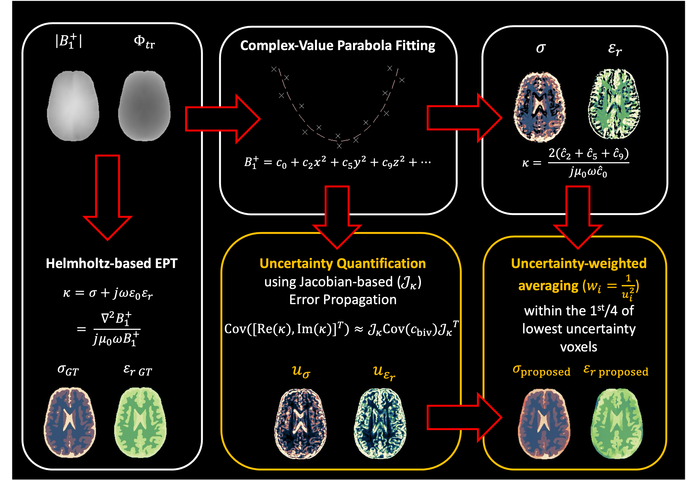

<p align="center">
  
</p>

<p align="center">
  <strong>u</strong>ncertainty <strong>q</strong>uantification in Helmholtz-Based
  <strong>E</strong>lectrical <strong>P</strong>roperties <strong>T</strong>omography
  <br>
  with Uncertainty-Guided Post-Processing
</p>

# uqEPT
`uqEPT` is a Python toolkit for **uncertainty quantification
in Helmholtz-based electrical properties tomography (EPT)**. It supports
Laplacian and surface-integral formulations under the **local homogeneity
assumption (LHA)**, combining anatomically adaptive reconstruction with
voxel-wise uncertainty propagation and uncertainty-guided post-processing.

<p align="center">
  
</p>

The current implementation supports:

- Complex B1-field based (HB & IB) and phase-based (PB) EPT with uncertainty quantification in both Laplacian (presented in ISMRM 2026) and surface-integral (new) formulations;
- Post-processing methods: anatomical median filtering (conventional) and anatomical minimum-uncertainty weighted-mean filtering (proposed).

## Reference

He Z, Lamy J, Arduino A, Zilberti L, Loureiro de Sousa P. Rigorous
Uncertainty Quantification for Helmholtz-based EPT: Application to
Uncertainty-Guided Post-processing. In: *2026 ISMRM-ISMRT Annual Meeting and
Exhibition*; Cape Town, South Africa; 2026.

[Download the conference abstract](https://hal.science/hal-05493748v1/file/Abstract%20%2300099.pdf)

If you use this code, please cite the reference above. A citation for the full
methodological paper will be added when available.

## Installation

Clone and install the required packages using `conda`:

```bash
conda create -n uqept -c conda-forge python=3.11 numpy scipy joblib tqdm numba connected-components-3d
conda activate uqept

git clone https://github.com/zhongzheng-he/uqEPT.git
cd uqEPT

# Verify that dependencies and uqEPT functions can be imported
python -c "import numpy, scipy, joblib, tqdm, numba, cc3d; from src import *; print('uqEPT imports successful')"
```
## Complex-valued EPT (HB and IB)

HB and IB reconstruct **conductivity and relative permittivity** from a complex
field `B` under the local homogeneity assumption (LHA).

**HB (standard Helmholtz-based EPT)** combines the measured $|B_1^+|$ map
with half the transceive phase $\varphi_{\mathrm{tr}}$, using the transceive-phase assumption:

$$
B_{\mathrm{HB}}=|B_1^+|\exp(j\varphi_{\mathrm{tr}}/2).
$$

**IB (image-based EPT)** uses a complex surrogate derived from a low-flip-angle
UTE/ZTE image:

$$
B_{\mathrm{IB}}=\sqrt{|S_{\mathrm{UTE}}|}\exp(j\varphi_{\mathrm{tr}}/2).
$$

### Laplacian formulation

The complex admittivity is

$$
\widehat{\kappa}_{\mathrm{Lap}}
= \frac{\nabla^2 B}{j\mu_0\omega B},
\qquad
\kappa = \sigma + j\omega\varepsilon_0\varepsilon_r.
$$

Conductivity and relative permittivity follow as

$$
\widehat{\sigma}=\mathrm{Re}(\widehat{\kappa}),
\qquad
\widehat{\varepsilon}_r
=\frac{\mathrm{Im}(\widehat{\kappa})}{\omega\varepsilon_0}.
$$

Both HB and IB use the same reconstruction function:

```python
import numpy as np
from src import B1_based_Laplacian_EPT_with_uq

sigma, epsilon_r, unc_sigma, unc_epsilon_r = B1_based_Laplacian_EPT_with_uq(
    B,                      # complex HB or IB field (3D array)
    kernel_size=[11,11,11], # 2nd order polynomial-fitting kernel size
    shape="cube",           # fitting-kernel geometry (cube, ellipse, cross)
    Ref=reference_image,    # anatomical image or segmentation(recommended)
    ROI=brain_mask,         # ROI mask
    h=[1e-3,1e-3,1e-3],     # voxel spacing [m]
    omega=2*np.pi*128e6,    # Larmor angular frequency [rad/s]
    thresh=0.05,            # anatomical similarity threshold [0,1]
    n_jobs=-1,              # number of parallel workers, -1 if using all available cores
)
```

### Surface-integral formulation

SI EPT integrates fitted first derivatives over a local boundary. This spatial
aggregation can reduce noise sensitivity.

For an integration region $\Omega$ with outward unit normal $\mathbf{n}$,

$$
\widehat{\kappa}_{\mathrm{SI}}
=\frac{\displaystyle\oint_{\partial\Omega}\nabla B\cdot\mathbf{n}\,dA}
{\displaystyle j\mu_0\omega\int_\Omega B\,dV}.
$$

Use the same HB or IB field `B` defined above. Conductivity and relative
permittivity are extracted from $\widehat{\kappa}_{\mathrm{SI}}$ in the same
way as for Laplacian EPT.

```python
import numpy as np
from src import B1_based_surface_integral_EPT_with_uq

sigma, epsilon_r, unc_sigma, unc_epsilon_r = (
    B1_based_surface_integral_EPT_with_uq(
        B,                          # complex HB or IB field (3D array)
        fit_kernel_size=[11,11,11], # 2nd order polynomial-fitting kernel size
        int_kernel_size=[11,11,11], # surface integral kernel size
        fit_shape="cube",           # fitting-kernel shape (cube, ellipse, cross)
        int_shape="cube",           # surface-integral kernel shape (cube, ellipse, cross)
        Ref=reference_image,        # anatomical image or segmentation(recommended)
        ROI=brain_mask,             # ROI mask
        h=[1e-3,1e-3,1e-3],         # voxel spacing [m]
        omega=2*np.pi*128e6,        # Larmor angular frequency [rad/s]
        thresh=0.05,                # anatomical similarity threshold [0,1]
        n_jobs=-1,                  # number of parallel workers,-1 if using all available cores
    )
)
```


## Simplified phase-based EPT (PB)

PB estimates **conductivity only** by neglecting $\nabla|B_1^\pm|$ terms, using only the transceive phase.
### Laplacian formulation
$$
\widehat{\sigma}_{\mathrm{PB,Lap}}
=\frac{\nabla^2\varphi_{\mathrm{tr}}}{2\mu_0\omega}.
$$
```python
import numpy as np
from src import phase_based_Laplacian_EPT_with_uq

sigma, unc_sigma = phase_based_Laplacian_EPT_with_uq(
    PhiTR,                  # unwrapped transceive phase in radians (3D array)
    kernel_size=[11,11,11], # 2nd order polynomial-fitting kernel size
    shape="cube",           # fitting-kernel shape (cube, ellipse, cross)
    Ref=reference_image,    # anatomical image or segmentation(recommended)
    ROI=brain_mask,         # ROI mask
    h=[1e-3,1e-3,1e-3],     # voxel spacing [m]
    omega=2*np.pi*128e6,    # Larmor angular frequency [rad/s]
    thresh=0.05,            # anatomical similarity threshold [0,1]
    n_jobs=-1,              # number of parallel workers,-1 if using all available cores
)
```

### Surface-integral formulation

Similarly, the phase-only SI estimator is

$$
\widehat{\sigma}_{\mathrm{PB,SI}}
=\frac{\displaystyle\oint_{\partial\Omega}
\nabla\varphi_{\mathrm{tr}}\cdot\mathbf{n}\,dA}
{2\mu_0\omega V_\Omega},
\qquad V_\Omega=\int_\Omega dV.
$$

```python
import numpy as np
from src import phase_based_surface_integral_EPT_with_uq

sigma, unc_sigma = phase_based_surface_integral_EPT_with_uq(
    PhiTR,                      # unwrapped transceive phase in radians (3D array)
    fit_kernel_size=[11,11,11], # 2nd order polynomial-fitting kernel size
    int_kernel_size=[11,11,11], # surface integral kernel size
    fit_shape="cube",           # fitting-kernel shape (cube, ellipse, cross)
    int_shape="cube",           # surface-integral kernel shape (cube, ellipse, cross)
    Ref=reference_image,        # anatomical image or segmentation(recommended)
    ROI=brain_mask,             # ROI mask
    h=[1e-3,1e-3,1e-3],         # voxel spacing [m]
    omega=2*np.pi*128e6,        # Larmor angular frequency [rad/s]; use your value
    thresh=0.05,                # anatomical similarity threshold [0,1]
    n_jobs=-1,                  # number of parallel workers,-1 if using all available cores
)
```


**About uncertainty:** both formulations propagate covariance estimated from
local polynomial-fitting residuals. The implementation then penalizes the
uncertainties of estimates outside its predefined physical ranges. The
returned `unc_*` maps include this adjustment and guide post-processing;
they should not be interpreted as a complete measure of reconstruction error.

## Anatomical post-processing

Both filters use the anatomical reference to select a local neighborhood
around each voxel. They can be applied to any of the reconstructions above.

### Anatomical median filter

The median filter replaces each estimate with the median of its anatomical
neighborhood $\mathcal{N}_p$:

$$
\widehat{x}_{\mathrm{median}}(p)
=\mathrm{median}_{q\in\mathcal{N}_p}x(q).
$$

```python
import numpy as np
from src import anatomical_median_filter

sigma_f_med = anatomical_median_filter(
    sigma,                  # input conductivity/permittivity map
    Ref=reference_image,    # anatomical image or segmentation(recommended)
    ROI=brain_mask,         # ROI mask
    kernel_size=[21,21,21], # kernel size
    shape="cube",           # kernel shape (cube, ellipse, cross)
    thresh=0.05,            # anatomical similarity threshold [0,1]
    n_jobs=-1,              # number of parallel workers,-1 if using all available cores
)
```

### Proposed uncertainty-guided filter

The proposed filter selects approximately the lowest-uncertainty quarter of
the anatomical neighborhood, with at least one voxel retained. It then
combines those estimates using inverse-variance weights:

$$
\widehat{x}_{\mathrm{proposed}}(p)
=\frac{\displaystyle\sum_{q\in\mathcal{Q}_p}x(q)/u(q)^2}
{\displaystyle\sum_{q\in\mathcal{Q}_p}1/u(q)^2},
$$

where $\mathcal{Q}_p$ is the selected subset and $u(q)$ is the corresponding
uncertainty. Lower-uncertainty estimates receive greater weight. The code
falls back to the subset median when the weight sum is non-finite or too small.

```python
import numpy as np
from src import anatomical_min_uncertainty_weighted_mean_filter

sigma_f_min_unc = anatomical_min_uncertainty_weighted_mean_filter(
    sigma,                  # input conductivity/permittivity map
    uncertainty=unc_sigma,  # matching uncertainty map
    Ref=reference_image,    # anatomical image or segmentation(recommended)
    ROI=brain_mask,         # ROI mask
    kernel_size=[21,21,21], # kernel size
    shape="cube",           # kernel shape (cube, ellipse, cross)
    thresh=0.05,            # anatomical similarity threshold [0,1]
    n_jobs=-1,              # number of parallel workers,-1 if using all available cores
)
```


## Practical tips

- The kernel sizes above are examples, not universally optimal settings. Use
  odd dimensions and enough anatomical neighbors.
- Larger kernels can suppress noise but may blur small structures and increase
  boundary artifacts. Smaller kernels better localize the reconstruction (also good for LHA) but
  are more sensitive to noise.
- Adjust `thresh` if using the magnitude image (e.g., MPRAGE); it controls which
  neighboring voxels are considered similar to the center voxel. The examples use 0.05; the function default is 0.1.
- Start with `n_jobs=1`. Increase it if memory allows; `n_jobs=-1` uses all
  available CPU cores. The first run also includes Numba compilation time.


## Available EPT Data for testing
You can test `uqEPT` using the datasets described in the MR-EPT
standardization guideline:

[Download the datasets from Zenodo](https://doi.org/10.5281/zenodo.17879937).

**Reference:** S. Mandija, A. Arduino, C. Cui, et al., “Standardization of MR
Electrical Properties Tomography: A Guideline From the ISMRM Electro-Magnetic
Tissue Properties Study Group,” *Journal of Magnetic Resonance Imaging* 63,
no. 4 (2026): 1204–1207. [https://doi.org/10.1002/jmri.70230](https://doi.org/10.1002/jmri.70230).


## Contact

Zhongzheng He, PhD<br>
ICube, Université de Strasbourg, Strasbourg, France<br>
zhongzheng.he@unistra.fr

## License

See [`LICENSE`](LICENSE).
